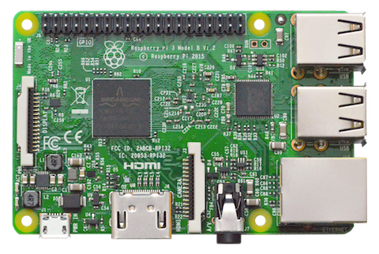

# Registrador para el sistema de control de accesos mediante sensor biométrico de huella dactilar

Este dispositivo se encarga de registrar las nuevas huellas de los usuarios al sistema de control de accesos, precisa de la conexión con el servidor MQTT y PostgreSQL mencionados en el proyecto de backend mencionado en los requisitos de este proyecto.

## Requisitos

### Hardware

El sensor de huellas debe estar conectado al bus serial del GPIO y alimentado con 5V.

### Software

* [Hardware de interfaz sensorial y control de puertas](https://github.com/djimenezjerez/control_accesos_hardware)
* [Backend de administración del sistema](https://github.com/djimenezjerez/control_accesos_backend)
* [Frontend de administración del sistema](https://github.com/djimenezjerez/control_accesos_frontend)

## Documentación

* [Manual de instalación](./INSTALL.md)
* [LPG-Bolivia](https://softwarelibre.gob.bo/licencia.php)
